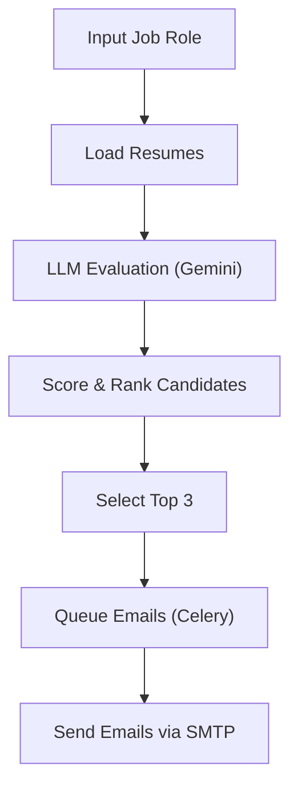

# AI-Powered ATS Resume Screener & Outreach  


---

## Overview

This project is an **end-to-end AI-powered recruiting pipeline** that automates resume screening, candidate ranking, and outreach.
Unlike traditional ATS systems that rely on keyword matching, this system leverages a **Large Language Model (LLM)** to evaluate resumes contextually — considering experience, skills, and relevance to the job role.

---

## Key Features

- **AI Resume Screening** using Gemini API  
- **ATS Scoring (0–100)** with structured evaluation  
- **Top Candidate Ranking** (dynamic per job role)  
- **Automated Personalized Emails**  
- **Asynchronous Processing with Celery + Redis**  
- **Retry Mechanism for Email Failures**  
- **JSON Export of Results for Auditability**

---

## How It Works


## Tech Stack Used
| Layer          | Technology                 |
| -------------- | -------------------------- |
| AI Engine      | Gemini API (LLM)           |
| Backend        | Python                     |
| Task Queue     | Celery                     |
| Message Broker | Redis                      |
| Email Service  | SMTP (MailHog for testing) |
| Data Storage   | JSON                       |
| Environment    | dotenv                     |

## Project Structure
├── main.py              
├── screener.py        
├── tasks.py           
├── resumes.json            
├── results_*.json             
├── requirements.txt            
└── README.md            

## Setup

### Install Dependencies
```
pip install -r requirements.txt
```
### Run Redis Server
```
redis-server
```
### Start Mailhog
```
wget https://github.com/mailhog/MailHog/releases/download/v1.0.1/MailHog_linux_amd6
sudo mv MailHog_linux_amd64 /usr/local/bin/mailhog
mailhog
```
### Start Celery Worker on vertual env
```
source venv/bin/activate
python -m celery -A tasks worker --loglevel=info
```
### Run the Pipeline
```
python main.py
```
## Execution
```
Welcome to Ai-Powered ResumeScreener.com
    
  Enter the job role you want to screen candidates for.
  Job Role > SDE

  Starting AI screening pipeline for: SDE


============================================================
  Screening resumes for: SDE
============================================================

  Evaluating Ananya Sharma (R001)... Score: 65  |  Partial fit
  Evaluating Rohan Mehta (R002)... Score: 80  |  Recommended
  Evaluating Priya Nair (R003)... Score: 88  |  Strongly Recommended
  Evaluating Karthik Reddy (R004)... Score: 78  |  Recommended
  Evaluating Sneha Kulkarni (R005)... Score: 55  |  Maybe
  Evaluating Arjun Verma (R006)... Score: 88  |  Strongly Recommended
  Evaluating Meera Iyer (R007)... Score: 68  |  Maybe
  Evaluating Vikram Singh (R008)... Score: 88  |  Strongly Recommended

============================================================
  TOP 3 CANDIDATES FOR: SDE
============================================================

  #1  Priya Nair
       ATS Score   : 88/100
       Fit Summary : Priya presents as a strong candidate for an SDE role with a focus on AI/ML due to her specialized education from IIT Hyderabad and practical experience in LLM fine-tuning and RAG pipelines. Her projects demonstrate a clear ability to apply AI concepts to real-world problems, making her a promising contender.
       Strengths   : Strong AI/ML specialization with IIT Hyderabad background, Hands-on experience with LLMs, RAG, and LangChain, Demonstrated project work in AI-powered tools
       Missing     : Core SDE skills (e.g., specific programming languages beyond Python, data structures, algorithms, software design patterns), Experience with large-scale software development lifecycle
       Verdict     : Strongly Recommended

  #2  Arjun Verma
       ATS Score   : 88/100
       Fit Summary : Arjun Verma is a strong candidate for an SDE role with 3.5 years of experience in full-stack development. His resume highlights relevant skills in Java, Spring Boot, React, microservices, and DevOps tools like Docker and Kubernetes, aligning well with typical SDE responsibilities.
       Strengths   : Full-stack development experience, Proficiency in Java, Spring Boot, and React, Experience with microservices architecture and CI/CD
       Missing     : None
       Verdict     : Strongly Recommended

  #3  Vikram Singh
       ATS Score   : 88/100
       Fit Summary : Vikram has substantial backend development experience, particularly with Python and Django, aligning well with typical SDE roles. His project experience demonstrates practical application of skills like API integration and scalable system design.
       Strengths   : Python/Django Expertise, API Development & Integration, Database Management (PostgreSQL, Redis)
       Missing     : Frontend Technologies (e.g., JavaScript, React/Angular/Vue), Cloud Platforms (e.g., AWS, Azure, GCP)
       Verdict     : Strongly Recommended

Full results saved to: results_sde.json

  Ready to send shortlist emails to top 3 candidates.
  Proceed with sending emails? (yes/no) > yes

============================================================
  Dispatching shortlist emails for: SDE
============================================================
  Queued email for #1 Priya Nair — Task ID: ab2fe177-852f-418c-9907-00862b461a5c
  Queued email for #2 Arjun Verma — Task ID: 4ed419f1-02d0-4be6-9ed0-2611066e5580
  Queued email for #3 Vikram Singh — Task ID: e380d557-f57a-4cff-aaf9-ad43d1f3e0cc

  Emails are sent to Top 3 shortlisted candidates.

============================================================
  PIPELINE COMPLETE
============================================================
  Role Screened  : SDE
  Total Resumes  : 8
  Shortlisted    : 3

  #1  Priya Nair
       Score      : 88/100
       Verdict    : Strongly Recommended
       Email sent : priya.nair@email.com

  #2  Arjun Verma
       Score      : 88/100
       Verdict    : Strongly Recommended
       Email sent : arjun.verma@email.com

  #3  Vikram Singh
       Score      : 88/100
       Verdict    : Strongly Recommended
       Email sent : vikram.singh@email.com

Emails sent to the Top 3 shortlisted candidates.
============================================================
```

